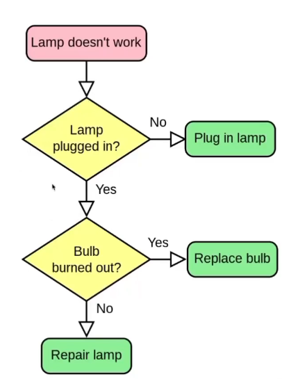

# 一个基于 self-attention 改进的idea

* Q是query矩阵，K是key矩阵，V是value矩阵
  * 考虑key矩阵的特征应该来自value矩阵
  * Q和K类似与钥匙和锁的关系，应该也能又K生成Q

# 3D 目标检测坐标系基础

## masked matrix
* 模拟rnn模型的decoder中，当前的输出依赖于上一个rnn cell的隐层输出+当前输入

  
# nlp 一些理解
## seq2seq
* 由encoder 隐含编码 decoder 组成
* 典型代表有基于RNN结构的，transformer
## auto-regressive
* 自回归模型

# self-Attention
* 计算全局关联性
* 对输入加权求和

# transformer
* seq2seq的模型的一种，依赖于self-attention

* detr中的transformer

# 我的想法
# 1. 我的理解
* 传统基于anchor的目标检测包涵一个先验知识(预设anchor框的`大小`和`长宽比`与待检测目标的尺寸有关)
* detr类型的目标检测避免了依赖该先验知识，但是它引入了新的先验知识(需要训练数据集和测试数据集中的待检测目标有相同的位置分布)
  * 
# 2. 提出想法
* 卷积由于其参数共享的计算方式有平移不变性的特点
* 对于训练数据集和测试数据集，即使某些待检测目标有不同的位置分布，也能很好的映射出相同的值

<b>总之，我的理解是基于transformer模型的目标检测模型，它的表达能力受限制于训练数据集里面的目标位置分布，而CNN方向的则没有这样的限制</b>

<b>所以，是否对object queries 的生成方式进行一些改进，避免其依赖先验</b>(训练数据集和测试数据集中的待检测目标有相同的位置分布)

# 机器学习常见的概念
## indicator function
* x是元素，A是集合

* 括号内为条件，条件成立为1

## bbox和groudth 直接常用的损失函数
* 过时：MSE和smooth L1(损失函数不能很好的反映检测效果)

不同的bbox(黑色)对应损失值一样
* <b>IOU loss</b>

* <b>Generalized IOU</b>为了解决`IoU loss在检测框和ground truth在没有重合区域的时候IoU loss的值统一为1`的问题(即使是错误，也应该有错的多或者错的少)

## FLOPs 和 FLOPS
* FLOPS：floating point operations per second
  * 衡量硬件的计算能力
* FLOPs：floating point operations
  * 衡量模型的计算量大小
  * 

# position embedding和encoding
* 因为transformer模型不能使用序列的位置信息，从而在序列中增加一些位置信息
## embedding
* learned 一般是随机初始的tensor，可学习
* 例如vit transformer
## encoding
* fixed 基于序列位置和维度的固定编码
* 例如 detr 
* 如下图，当2i/dmodel=1，函数一个周期增大到10000*2pi，此时随着position变化，秩i更高的特征变换更缓慢

# chat GPT generative pretrain-transformer  

# course
* cs224n

# cite
## web
* http://nlp.seas.harvard.edu/annotated-transformer/
## proof
* https://github.com/BAI-Yeqi/Statistical-Properties-of-Dot-Product/blob/master/proof.pdf

# 会议论文格式总结
* abtract 
  三句话
  * 研究的背景 || 发现的问题
  * 提出新的方法
  * 该方法的结果 || 解决了问题

* introduction
* related works
  * 目的：通过业界相关工作存在的问题说明本文研究的意义
* model or approach
  * 按照模型结构，从bottom到up描述
  * 最后一般是`loss function` 的设计
* experiments
  * 实验平台(数据集，显卡)
  * 技术细节(超参数的设定，使用的tricks)
  * 对比试验
  * 消融试验
  * 分析

# 画图方法
## <b>流程图</b>
 
代码的流程和决策
## <b>架构图</b>
 
方案的选定
从下向上，从左至右
## <b>关系图</b>

设计模式(对象的继承，实现)
## <b>时序图</b>

操作系统

# 

